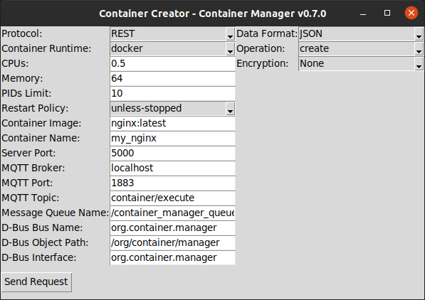

# Container Manager

**Container Manager** is a modular, production-ready C++ service for unified container management across Docker, Podman, and more (planned). It supports REST, MQTT, POSIX Message Queue, D-Bus, gRPC (planned), Docker/Podman CLI, HTTP-API with incoming plain/encrypted JSON & Protobuf data.

Features include extensible architecture, pluggable database backend (embedded by default, Redis optional), robust logging, thread pool for all protocols, and enterprise-grade security with AES-256-GCM or ChaCha20-Poly1305 encryption.

It is designed for developers and system integrators who need a flexible, secure, and modular foundation for building container orchestration for automotive usecase.

> **This is a reference architecture and template project** designed to demonstrate production-grade C++ patterns for container management systems. Clone, modify, and extend as needed for your specific requirements.

**Example**

- **Need D-Bus + Podman REST API + Protobuf + AES encryption?** ✅ Clone and configure.
- **Want MQTT + Docker CLI + JSON + Redis database + No encryption?** ✅ Clone and configure.
- **Building a container orchestrator with custom runtime?** ✅ Extend the runtime layer.

## Features

- **Unified Container Management:**  
  Manage Docker and Podman containers through a single interface.

- **Extensible Command Pattern:**  
  Easily add support for new runtimes or operations.

- **Multi-Protocol Support:**  
  REST (HTTP/JSON or Protobuf), MQTT, POSIX Message Queue, D-Bus (session bus), and gRPC (planned).

- **Flexible Data Formats:**  
  JSON or Protocol Buffers (protobuf) for high-performance or strongly-typed APIs.

- **Thread Pool:**  
  Efficient request handling using a configurable thread pool.

- **Pluggable Database Backend:**  
  Embedded database by default; Redis optional via CMake flag.

- **Robust Logging:**  
  Integrated with Google glog.

- **Configurable Security:**  
  AES-256-GCM and ChaCha20-Poly1305 encryption for all protocols.

- **Python UI:**  
  Cross-platform GUI for sending requests to the backend (see below).

## Folder Structure

```
App/
├── api/          # Protocol handlers (REST, MQTT, MQ, D-Bus and future protocols)
├── core/         # Business logic (service layer)
├── database/     # Database interface, embedded and Redis implementations (pluggable)
├── executor/     # Request executors (JSON, Protobuf, handle decryption)
├── runtime/      # Command pattern implementations for Docker CLI, Podman CLI, Docker API, Podman API, etc.
├── utils/        # Common utilities (thread pool, logging, etc.)
├── security/     # Security providers (AES-GCM, ChaCha20, Null)
├── main.cpp      # Application entry point
└── third_party/  # External dependencies (nlohmann_json, httplib)
```

## Quick Start

### Build

```sh
cmake .. -DENABLE_REST=ON -DENABLE_MQTT=ON -DENABLE_MSGQUEUE=ON -DENABLE_DBUS=ON -DENABLE_PROTOBUF=ON -DENABLE_ENCRYPTION=ON -DSECURITY_ALGORITHM=CHACHA20
make
```

- See CMake flags in the next section for more options.

### Run

```sh
./CM
```

The server will start and listen on the enabled protocols and data formats as per your build configuration.

## Video Tutorials

### 1. Project Overview & Motivation

[](https://www.youtube.com/watch?v=VIDEO_ID_1)

> _In this video, we explain why Container Manager was created, the problems it solves, and the advantages it brings to container orchestration and automation._

---

### 2. Build, UI Usage & Live Demo

[](https://www.youtube.com/watch?v=VIDEO_ID_2)

> _This video demonstrates how to build the project, use the Python UI, and deploy containers using different protocols and runtimes._

## Configuration

You can enable or disable each protocol, data format, and security feature using CMake flags:

- `ENABLE_REST` (REST/HTTP server)
- `ENABLE_MQTT` (MQTT subscriber)
- `ENABLE_MSGQUEUE` (POSIX Message Queue)
- `ENABLE_DBUS` (D-Bus consumer)
- `ENABLE_GRPC` (gRPC, planned)
- `ENABLE_PROTOBUF` (Protobuf support; if OFF, only JSON is used)
- `ENABLE_REDIS` (Redis database backend; if OFF, embedded database is used)
- `ENABLE_ENCRYPTION` (Enable encryption for all protocols)
- `SECURITY_ALGORITHM` (Select encryption algorithm: `AES_GCM` or `CHACHA20`)

> **Note:**  
> Encryption key files must be present in `storage/security/` as described in the architecture documentation.  
> The selected algorithm must match between the backend and any client sending encrypted payloads.

## Dependencies by Feature

The following table summarizes which C++ libraries/packages are required for each protocol, data format, and feature.  
Install only what you need based on your chosen CMake flags.

| Protocol / Data Format | CMake Flag           | Required Packages                     |
| ---------------------- | -------------------- | ------------------------------------- |
| REST (HTTP/JSON)       | ENABLE_REST=ON       | nlohmann_json, glog, httplib          |
| MQTT                   | ENABLE_MQTT=ON       | mosquitto, nlohmann_json, glog        |
| Message Queue          | ENABLE_MSGQUEUE=ON   | nlohmann_json, glog                   |
| D-Bus                  | ENABLE_DBUS=ON       | sdbus-c++, nlohmann_json, glog        |
| gRPC (planned)         | ENABLE_GRPC=ON       | grpc++, protobuf, nlohmann_json, glog |
| Protobuf               | ENABLE_PROTOBUF=ON   | protobuf                              |
| Redis DB               | ENABLE_REDIS=ON      | cpp_redis, redis-server               |
| Embedded DB (default)  | (default)            | (no extra dependencies)               |
| Encryption             | ENABLE_ENCRYPTION=ON | libssl-dev (OpenSSL)                  |

**Notes:**

- **JSON** is always available (unless you only enable Protobuf).
- **Protobuf** is optional and only needed if you want binary serialization.
- **Embedded database** is used unless you explicitly enable Redis.
- **Encryption** is ON by default and recommended for production.

## API Reference

Container Manager exposes a unified API for container operations over multiple protocols and data formats:

- **REST:**
  - `POST /execute` — Accepts JSON or Protobuf payloads.
- **MQTT:**
  - **Topic:** `container/execute` — Publish JSON, Protobuf, or encrypted (Base64) payloads.
- **POSIX Message Queue:**
  - **Queue Name:** `/container_manager_queue` — Send JSON, Protobuf, or encrypted (Base64) payloads.
- **D-Bus:**
  - **Bus Name:** `org.container.manager`
  - **Object Path:** `/org/container/manager`
  - **Interface:** `org.container.manager`
  - **Method:** `Execute` — Accepts JSON string or Base64-encoded Protobuf/encrypted payload.

See [Usage Examples](#usage-examples) below for request formats and protocol-specific details.

## Usage Examples

### Example JSON Request

```json
{
  "runtime": "docker-api",
  "operation": "create",
  "parameters": [
    {
      "container_name": "my_nginx",
      "cpus": "0.5",
      "memory": "128",
      "pids": "10",
      "restart_policy": "unless-stopped",
      "image_name": "nginx:latest"
    }
  ]
}
```

- Use `"runtime": "docker"` or `"podman"` for CLI-based management.
- Use `"runtime": "docker-api"` or `"podman-api"` for REST API-based management.

### Example Protobuf Request

- See `executor/proto/container_manager.proto` for the schema.
- Use the generated Python or C++ classes to serialize/deserialize requests.
- Example Python code to send a Protobuf request via Message Queue:

```python
import posix_ipc
import container_manager_pb2  # Generated by protoc

req = container_manager_pb2.ContainerRequest()
req.runtime = "docker-api"
req.operation = "create"
param = req.parameters.add()
param.container_name = "my_nginx"
param.cpus = "0.5"
param.memory = "128"
param.pids = "10"
param.restart_policy = "unless-stopped"
param.image_name = "nginx:latest"

payload = req.SerializeToString()
mq = posix_ipc.MessageQueue('/container_manager_queue', posix_ipc.O_CREAT)
mq.send(payload)
```

### HTTP Endpoint

- **POST** `/execute`
  - Send a JSON or Protobuf request as shown above to perform container operations.
  - For Protobuf, set the header: `Content-Type: application/octet-stream`
  - For encrypted payloads, set the header: `Content-Type: application/octet-stream` and send the encrypted bytes.

### MQTT Usage

- **Topic:** `container/execute`
- **Publish Example (JSON):**
  ```sh
  mosquitto_pub -h localhost -p 1883 -t container/execute -m '{ "runtime":"docker-api", "operation":"create", "parameters":[{"container_name":"my_nginx", "cpus":"0.5", "memory":"128", "pids":"10", "restart_policy":"unless-stopped", "image_name":"nginx:latest"}]}'
  ```
- **Publish Example (Protobuf or Encrypted):**
  Use the generated Protobuf class to serialize and send the message as binary.  
  If encryption is enabled, Base64-encode the encrypted payload before publishing.

### POSIX Message Queue Usage

- **Queue Name:** `/container_manager_queue`
- **Send Example (Python, JSON):**
  ```python
  import posix_ipc
  mq = posix_ipc.MessageQueue('/container_manager_queue', posix_ipc.O_CREAT)
  mq.send('{"runtime": "podman", "operation": "create", "parameters": [{"container_name": "my_nginx", "cpus": "0.5", "memory": "64", "pids": "10", "restart_policy": "unless-stopped", "image_name": "nginx:latest"}]}')
  ```
- **Send Example (Python, Protobuf or Encrypted):**
  See the Protobuf and encryption examples above.

### D-Bus (Session Bus) Usage

- **Bus Name:** `org.container.manager`
- **Object Path:** `/org/container/manager`
- **Interface:** `org.container.manager`
- **Method:** `Execute` (accepts a JSON string or Protobuf bytes as the first argument)

**Python Example (JSON):**

```python
import dbus
bus = dbus.SessionBus()
proxy = bus.get_object('org.container.manager', '/org/container/manager')
iface = dbus.Interface(proxy, dbus_interface='org.container.manager')
iface.Execute('{"runtime": "docker-api", "operation": "create", "parameters": [{"container_name": "my_nginx", "cpus": "0.5", "memory": "128", "pids": "10", "restart_policy": "unless-stopped", "image_name": "nginx:latest"}]}')
```

**Python Example (Protobuf or Encrypted):**

```python
import base64
encrypted_payload = ... # bytes from AES-GCM encryption
iface.Execute(base64.b64encode(encrypted_payload).decode())
```

## Python UI: Container Creator

A cross-platform Python GUI tool is provided for easily sending container management requests to the backend.



### Features

- Select protocol: REST (HTTP), MQTT, POSIX Message Queue, or D-Bus (session bus)
- Select data format: JSON or Protobuf
- Select runtime: Docker, Podman, Docker API, or Podman API
- Select operation: create, start, stop, restart, remove, available, etc.
- Fill in container parameters (runtime, operation, resources, image, etc.)
- Enable/disable AES-GCM or ChaCha20 encryption
- Send requests directly to the backend via REST, MQTT, Message Queue, or D-Bus

### How the UI Works

1. **Select the protocol** (REST, MQTT, MessageQueue, or DBus) from the dropdown.
2. **Select the data format** (JSON or Proto).
3. **Select the runtime** (docker, podman, docker-api, podman-api) and operation (create, start, stop, restart, remove, available, etc.).
4. **Fill in the container parameters** (CPUs, memory, image, etc.).
5. **Choose the encryption algorithm** (None, AES-256-GCM, or ChaCha20-Poly1305).
6. **Click "Send Request"** to send the request to the backend.
7. The UI will show a confirmation or error message after sending the request.

The UI automatically handles serialization, encryption, and protocol-specific details (such as Base64 encoding for D-Bus and MQTT).

### Requirements

- Python 3.7+
- [requests](https://pypi.org/project/requests/)
- [paho-mqtt](https://pypi.org/project/paho-mqtt/)
- [posix_ipc](https://pypi.org/project/posix_ipc/)
- [dbus-python](https://pypi.org/project/dbus-python/)
- [protobuf](https://pypi.org/project/protobuf/)
- [pycryptodome](https://pypi.org/project/pycryptodome/)
- Tkinter (usually included with Python)

Install dependencies:

```sh
pip install requests paho-mqtt posix_ipc dbus-python protobuf pycryptodome
```

### Usage

```sh
cd ui
python container_creator_app.py
```

## Extending the Project

- **Add a new runtime:**  
  Implement new command classes in `App/runtime/` and register them in `CommandFactory`.

- **Add a new operation:**  
  Extend the command pattern and update the service layer.

- **Add a new protocol:**  
  Implement a new API handler in `App/api/` (e.g., for Message Queue, D-Bus, gRPC, MQTT) and register it in the main application.

- **Add a new data format:**  
  Implement a new `RequestExecutor` (e.g., for Protobuf) in `App/executor/` and update the API handler to use it.

- **Change database backend:**  
  Implement the `IDatabaseHandler` interface for your preferred database (SQL, NoSQL, etc.) and update the service to use it.

- **Add a new security algorithm:**  
  Implement a new security provider in `App/security/` by extending the `ISecurityProvider` interface, and update the CMake configuration and executor logic to support it.

## Documentation & Architecture

- For a comprehensive overview of the system design, security, and extensibility, see [Architecture Documentation](docs/architecture/architecture.md).
- Doxygen HTML docs: After building, open `docs/doxygen/html/index.html` in your browser.

## Contributing

Contributions are welcome! Please open issues or pull requests for bug fixes, new features, or documentation improvements.

## License

This project is licensed under the [MIT License](LICENSE).

## Acknowledgements

- [glog](https://github.com/google/glog)
- [cpp_redis](https://github.com/Cylix/cpp_redis)
- [nlohmann/json](https://github.com/nlohmann/json)
- [httplib](https://github.com/yhirose/cpp-httplib)
- [mosquitto](https://mosquitto.org/)
- [sdbus-c++](https://github.com/Kistler-Group/sdbus-cpp)
- [OpenSSL](https://www.openssl.org/)
- [protobuf](https://developers.google.com/protocol-buffers)
- [Doxygen](https://www.doxygen.nl/)
- [pycryptodome](https://github.com/Legrandin/pycryptodome) (Python UI)
- [paho-mqtt](https://github.com/eclipse/paho.mqtt.python) (Python UI)
- [posix_ipc](https://github.com/osvenskan/posix_ipc) (Python UI)
- [dbus-python](https://gitlab.freedesktop.org/dbus/dbus-python) (Python UI)
