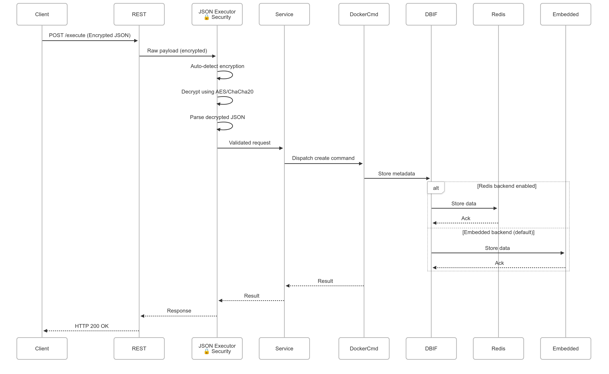

# Container Manager Architecture

## Overview

**Container Manager** is a modular, extensible, and production-ready C++ service for unified container management across Docker, Podman, and other runtimes.  
It is designed to support multiple communication protocols (REST, MQTT, POSIX Message Queue, D-Bus, gRPC) and data formats (JSON, Protobuf), making it suitable for diverse deployment scenarios and integration needs.

### System Architecture


## Folder Structure

```
App/
├── api/        # Protocol handlers (REST, MQTT, MQ, D-Bus, gRPC)
├── core/       # Business logic (service layer, command pattern)
├── database/   # Database interface and Redis implementation
├── executor/   # Request executors (JSON, Protobuf)
├── runtime/    # Command implementations for Docker CLI, Podman CLI, Docker API, Podman API, etc.
├── utils/      # Utilities (thread pool, logging, config)
├── main.cpp    # Application entry point
└── third_party/# External dependencies
```

## Component Descriptions

### 1. API Layer (Protocol Handlers)

- **REST API Server:**  
  Handles HTTP requests, parses JSON/Protobuf payloads, and forwards them to the executor layer.

- **MQTT Subscriber:**  
  Subscribes to a configured MQTT topic, receives messages, and forwards them to the executor.

- **POSIX Message Queue Consumer:**  
  Listens on a POSIX message queue for incoming requests.

- **D-Bus Consumer:**  
  Listens for method calls on the D-Bus session bus, enabling desktop and user-level IPC.

- **gRPC Server (planned):**  
  Will provide a strongly-typed, high-performance RPC interface using Protobuf.

**All protocol handlers are modular and can be enabled/disabled at build time via CMake flags.**

### 2. Executor Layer (Request Executors)

- **JSON Request Executor:**  
  Validates and parses incoming JSON requests, converting them to internal command objects.

- **Protobuf Request Executor:**  
  Validates and parses incoming Protobuf requests, converting them to internal command objects.

**The executor layer abstracts data format handling, allowing protocol handlers to remain agnostic of the underlying serialization.**

### 3. Core Layer (Service & Command Pattern)

- **Container Service Handler:**  
  Central business logic. Receives validated requests from executors, performs runtime checks, and dispatches commands.

- **Command Pattern:**  
  Each container operation (create, start, stop, etc.) is encapsulated as a command object.  
  Supports multiple runtimes (Docker CLI, Podman CLI, Docker API, Podman API, etc.) and is easily extensible.

### 4. Runtime Layer

- **Docker Commands:**  
  Implements container operations for Docker using the Docker CLI.

- **Podman Commands:**  
  Implements container operations for Podman using the Podman CLI.

- **Docker API Commands:**  
  Implements container operations using the Docker REST API over a Unix socket.

- **Podman API Commands:**  
  Implements container operations using the Podman REST API over a Unix socket.

> **Disclaimer:**  
> The `podman-api` runtime is not extensively tested. Use with caution and report any issues you encounter.

**The runtime layer can be extended to support additional container engines and APIs.**

### 5. Database Layer

- **IDatabaseHandler:**  
  Abstract interface for database operations (CRUD, state, metadata).

- **RedisDatabaseHandler:**  
  Production-ready Redis implementation of the database interface.

**The database layer is pluggable—swap Redis for any other backend by implementing the interface.**

### 6. Utilities

- **Thread Pool:**  
  Efficiently handles concurrent requests.

- **Logging:**  
  Uses Google glog for robust, production-grade logging.

- **Config:**  
  Centralized configuration structs for all protocols and system settings.

## Data Flow

1. **Request Reception:**  
   A request arrives via one of the enabled protocols (REST, MQTT, MQ, D-Bus, gRPC).

2. **Deserialization:**  
   The protocol handler forwards the raw payload to the appropriate executor (JSON or Protobuf).

3. **Validation & Parsing:**  
   The executor validates the request and converts it to an internal command object.

4. **Business Logic:**  
   The service handler checks runtime constraints, permissions, and dispatches the command.

5. **Command Execution:**  
   The command object performs the requested operation (e.g., create/start/stop container) using the appropriate runtime (Docker CLI, Podman CLI, Docker API, Podman API).

6. **Database Interaction:**  
   State and metadata are persisted/retrieved via the database interface.

7. **Response:**  
   The result is sent back via the originating protocol (if applicable).

## Extensibility

- **Add a Protocol:**  
  Implement a new handler in `api/`, register it in `main.cpp`, and add a CMake flag.

- **Add a Data Format:**  
  Implement a new executor in `executor/`, update protocol handlers to support it.

- **Add a Runtime:**  
  Implement new command classes in `runtime/`, register them in the command factory.

- **Change Database:**  
  Implement `IDatabaseHandler` for your preferred backend.

## Production-Readiness

- **Graceful Shutdown:**  
  All protocol consumers support `Stop()` and `Join()` for clean shutdown.

- **Signal Handling:**  
  (Recommended) Add signal handlers for SIGINT/SIGTERM to trigger shutdown.

- **Configurable:**  
  All protocol and system settings are centralized and can be externalized.

- **Logging:**  
  All errors and key events are logged with context.

- **Testing:**  
  Unit and integration tests are present; expand coverage as needed.

## Example Sequence Diagram



## Deployment Diagram


## Recommendations for Contributors

- **Follow the modular architecture:**  
  Add new features as isolated modules with clear interfaces.
- **Document all public APIs and classes.**
- **Write tests for new features and bug fixes.**
- **Update diagrams and documentation as the architecture evolves.**

## References

- [Doxygen Documentation](../docs/doxygen/html/index.html)
- [README.md](../README.md)

---

_For questions, suggestions, or contributions, please open an issue or pull request on GitHub._
