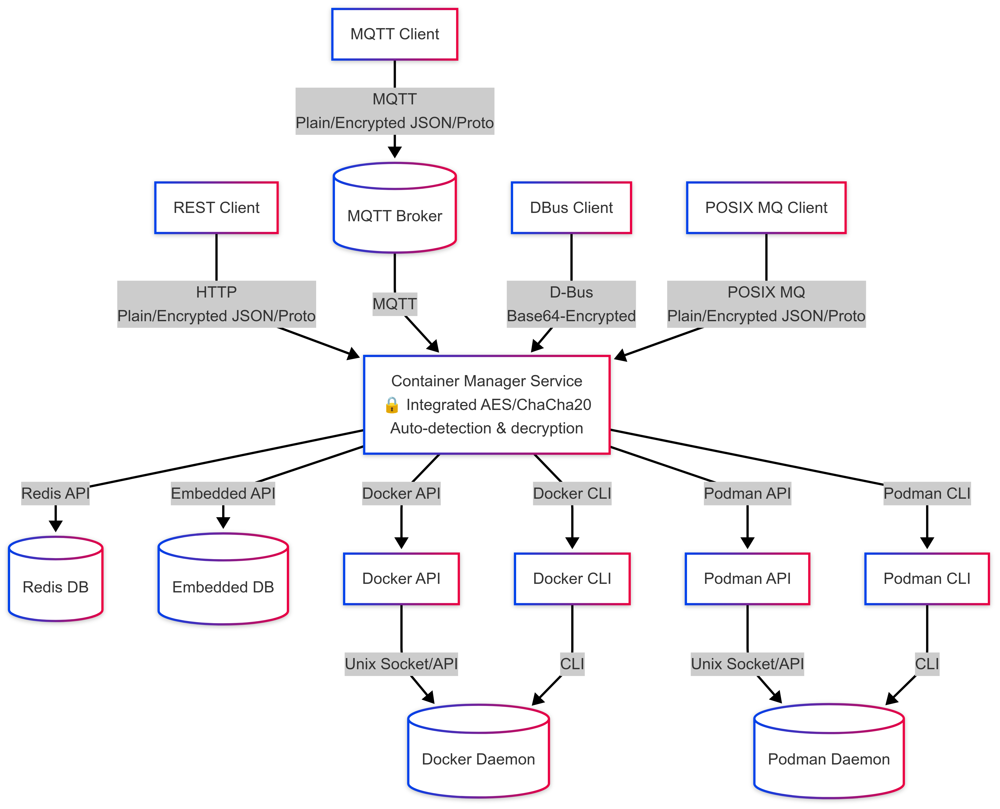

# Container Manager Architecture

## Overview

**Container Manager** is a modular, extensible, and production-ready C++ service for unified container management across Docker, Podman, and other runtimes. It is designed to support multiple communication protocols (REST, MQTT, POSIX Message Queue, D-Bus, gRPC (planned)) and data formats (JSON, Protobuf), making it suitable for diverse deployment scenarios and integration needs. The application supports optional end-to-end AES-256-GCM encryption for all incoming protocol payloads, providing confidentiality and integrity for over-the-air (OTA) requests. The application only decrypts incoming data; it does not encrypt outgoing responses.

### System Architecture


## Folder Structure

```
App/
├── api/        # Protocol handlers (REST, MQTT, MQ, D-Bus)
├── core/       # Business logic (service layer, command pattern)
├── database/   # Database interface and implementations (embedded, Redis)
├── executor/   # Request executors (JSON, Protobuf)
├── runtime/    # Command implementations for Docker CLI, Podman CLI, Docker API, Podman API, etc.
├── utils/      # Utilities (thread pool, logging, config, decryption)
├── main.cpp    # Application entry point
└── third_party/# External dependencies
```

## Component Descriptions

### 1. API Layer (Protocol Handlers)

- **REST API Server:**  
  Handles HTTP requests, parses JSON/Protobuf payloads (optionally encrypted), and forwards them to the executor layer.

- **MQTT Subscriber:**  
  Subscribes to a configured MQTT topic, receives messages (optionally encrypted), and forwards them to the executor.

- **POSIX Message Queue Consumer:**  
  Listens on a POSIX message queue for incoming requests (optionally encrypted).

- **D-Bus Consumer:**  
  Listens for method calls on the D-Bus session bus, enabling desktop and user-level IPC. Supports encrypted and unencrypted payloads, with automatic Base64 decoding for binary data.

- **gRPC Server (planned):**  
  Will provide a strongly-typed, high-performance RPC interface using Protobuf.

**All protocol handlers are modular and can be enabled/disabled at build time via CMake flags.  
All protocols support secure payload delivery using AES-256-GCM encryption for incoming data when enabled.**

### 2. Executor Layer (Request Executors)

- **JSON Request Executor:**  
  Validates and parses incoming JSON requests (optionally decrypting them), converting them to internal command objects.

- **Protobuf Request Executor:**  
  Validates and parses incoming Protobuf requests (optionally decrypting them), converting them to internal command objects.

**The executor layer abstracts data format and encryption handling, allowing protocol handlers to remain agnostic of the underlying serialization and security.**

### 3. Core Layer (Service & Command Pattern)

- **Container Service Handler:**  
  Central business logic. Receives validated requests from executors, performs runtime checks, and dispatches commands.

- **Command Pattern:**  
  Each container operation (create, start, stop, etc.) is encapsulated as a command object.  
  Supports multiple runtimes (Docker CLI, Podman CLI, Docker API, Podman API, etc.) and is easily extensible.

### 4. Runtime Layer

- **Docker Commands:**  
  Implements container operations for Docker using the Docker CLI.

- **Podman Commands:**  
  Implements container operations for Podman using the Podman CLI.

- **Docker API Commands:**  
  Implements container operations using the Docker REST API over a Unix socket.

- **Podman API Commands:**  
  Implements container operations using the Podman REST API over a Unix socket.

> **Disclaimer:**  
> The `podman-api` runtime is not extensively tested. Use with caution and report any issues you encounter.

**The runtime layer can be extended to support additional container engines and APIs.**

### 5. Database Layer

- **IDatabaseHandler:**  
  Abstract interface for database operations (CRUD, state, metadata).

- **EmbeddedDatabaseHandler:**  
  **Default:** Lightweight, fixed-size, in-memory key-value store for embedded and resource-constrained systems.  
  No external dependencies required.

- **RedisDatabaseHandler:**  
  Optional production-ready Redis implementation of the database interface.  
  Requires [cpp_redis](https://github.com/Cylix/cpp_redis) and a running Redis server.

**The database layer is pluggable—swap between embedded and Redis (or any other backend) by implementing the interface.  
Database selection is controlled via the `ENABLE_REDIS` CMake flag. If not set, the embedded database is used by default.**

### 6. Utilities

- **Thread Pool:**  
  Efficiently handles concurrent requests.

- **Logging:**  
  Uses Google glog for robust, production-grade logging.

- **Config:**  
  Centralized configuration structs for all protocols and system settings.

- **Encryption:**  
  AES-256-GCM decryption utilities for secure OTA payloads.  
  Encryption is enabled or disabled at build time via the `ENABLE_ENCRYPTION` CMake flag.  
  When enabled, all protocol handlers and executors transparently support decryption of encrypted payloads.  
  **Note:** The application only decrypts incoming data; it does not encrypt outgoing responses.

## Security & Encryption

- **AES-256-GCM Decryption:**  
  When `ENABLE_ENCRYPTION` is ON, all incoming protocol payloads can be decrypted using AES-256-GCM.

  - The encryption key and IV length are defined in the codebase and must match between client and server.
  - Encrypted payloads are formatted as `[IV|TAG|CIPHERTEXT]` and may be Base64-encoded for transport (e.g., over D-Bus).
  - Decryption and authentication are performed in the executor layer before request processing.
  - Encryption is optional and can be toggled at build time for compatibility with legacy or low-resource deployments.

- **Integrity & Confidentiality:**  
  AES-GCM provides both confidentiality and message authentication, ensuring that only authorized parties can read and modify requests.

- **Protocol Agnostic:**  
  Decryption is supported for all protocols (REST, MQTT, MQ, D-Bus).  
  Protocol handlers and executors automatically detect and decrypt encrypted payloads.

- **Configuration:**

  - Enable or disable decryption support at build time using the `ENABLE_ENCRYPTION` CMake flag.
  - Update the encryption key and IV as needed for your deployment.

- **Limitation:**  
  **This application only decrypts incoming encrypted data. It does not encrypt any outgoing responses.  
  If you require encrypted responses, you must implement this functionality separately.**

## Data Flow

1. **Request Reception:**  
   A request arrives via one of the enabled protocols (REST, MQTT, MQ, D-Bus, gRPC (planned)).  
   If encryption is enabled, the payload may be encrypted.

2. **Deserialization & Decryption:**  
   The protocol handler forwards the raw payload to the appropriate executor (JSON or Protobuf).  
   The executor detects if the payload is encrypted and, if so, decrypts it using AES-256-GCM before parsing.

3. **Validation & Parsing:**  
   The executor validates the request and converts it to an internal command object.

4. **Business Logic:**  
   The service handler checks runtime constraints, permissions, and dispatches the command.

5. **Command Execution:**  
   The command object performs the requested operation (e.g., create/start/stop container) using the appropriate runtime (Docker CLI, Podman CLI, Docker API, Podman API).

6. **Database Interaction:**  
   State and metadata are persisted/retrieved via the database interface.  
   The actual backend (embedded or Redis) is selected at build time.

7. **Response:**  
   The result is sent back via the originating protocol (if applicable).  
   **Note:** Outgoing responses are not encrypted by this application.

## Extensibility

- **Add a Protocol:**  
  Implement a new handler in `api/`, register it in `main.cpp`, and add a CMake flag.

- **Add a Data Format:**  
  Implement a new executor in `executor/`, update protocol handlers to support it.

- **Add a Runtime:**  
  Implement new command classes in `runtime/`, register them in the command factory.

- **Change Database:**  
  Implement `IDatabaseHandler` for your preferred backend.  
  Select the backend at build time using the appropriate CMake flag.

- **Change Security:**  
  Update the encryption key, IV, or algorithm as needed.  
  Toggle decryption support at build time with `ENABLE_ENCRYPTION`.

## Production-Readiness

- **Graceful Shutdown:**  
  All protocol consumers support `Stop()` and `Join()` for clean shutdown.

- **Signal Handling:**  
  (Recommended) Add signal handlers for SIGINT/SIGTERM to trigger shutdown.

- **Configurable:**  
  All protocol and system settings are centralized and can be externalized.

- **Logging:**  
  All errors and key events are logged with context.

- **Testing:**  
  Unit and integration tests are present; expand coverage as needed.

- **Security:**  
  AES-256-GCM decryption is available for all protocols and data formats, providing strong security guarantees for production deployments.  
  **Encryption of outgoing responses is not implemented.**

## Example Sequence Diagram


## Deployment Diagram



## Recommendations for Contributors

- **Follow the modular architecture:**  
  Add new features as isolated modules with clear interfaces.
- **Document all public APIs and classes.**
- **Write tests for new features and bug fixes.**
- **Update diagrams and documentation as the architecture evolves.**
- **If you add or change encryption/decryption, update this document and the security section.**

## References

- [Doxygen Documentation](../docs/doxygen/html/index.html)
- [README.md](../README.md)

---

_For questions, suggestions, or contributions, please open an issue or pull request on GitHub._
