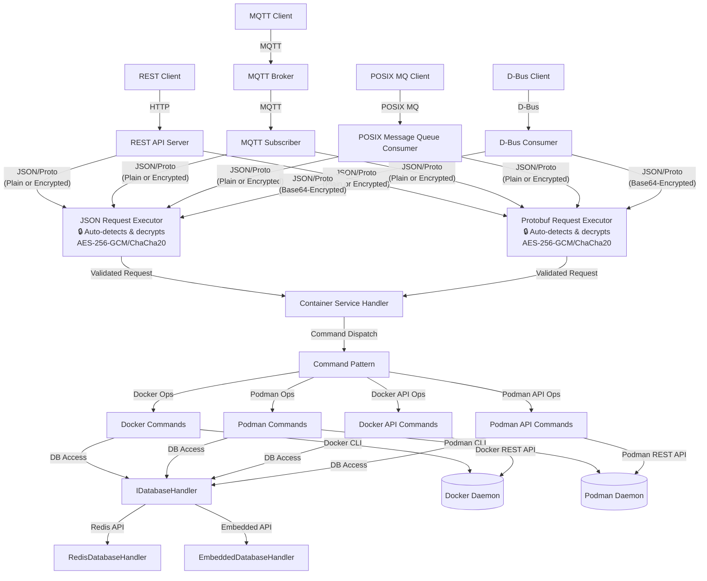
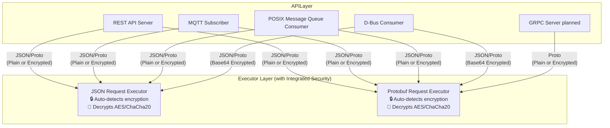
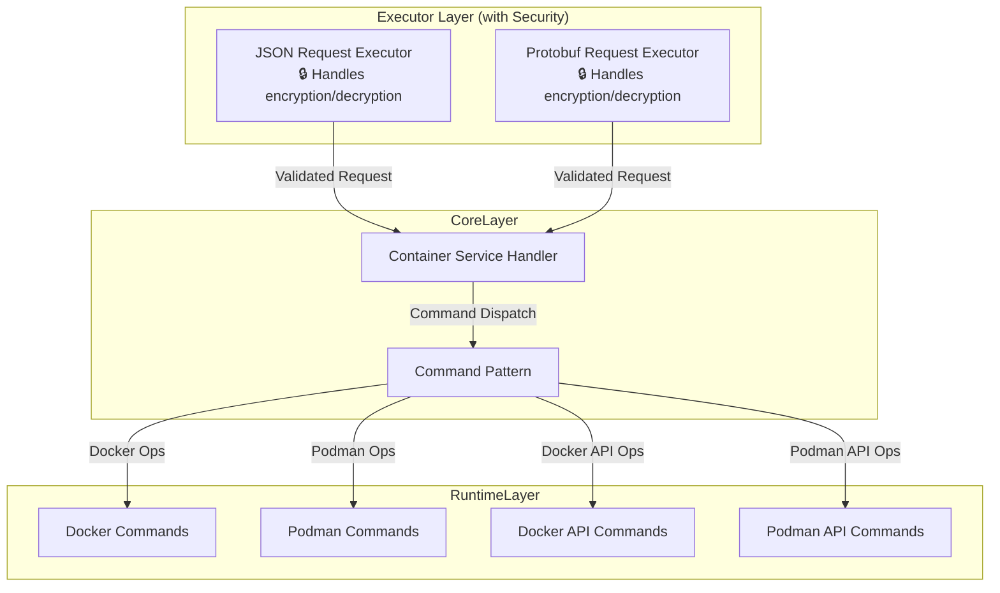
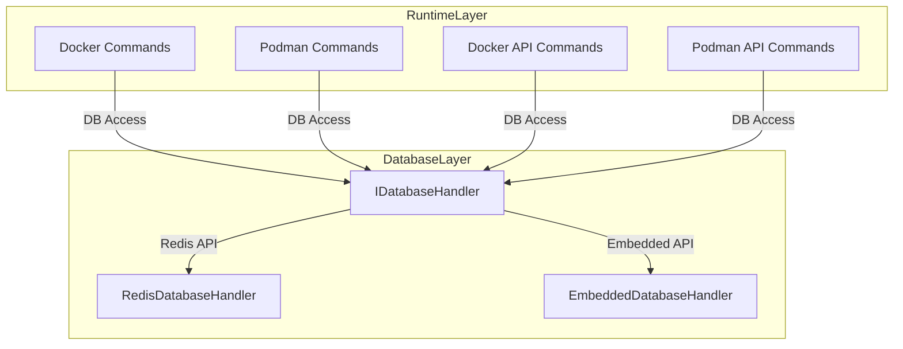
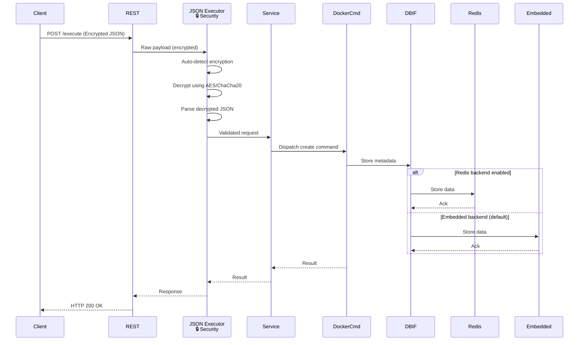
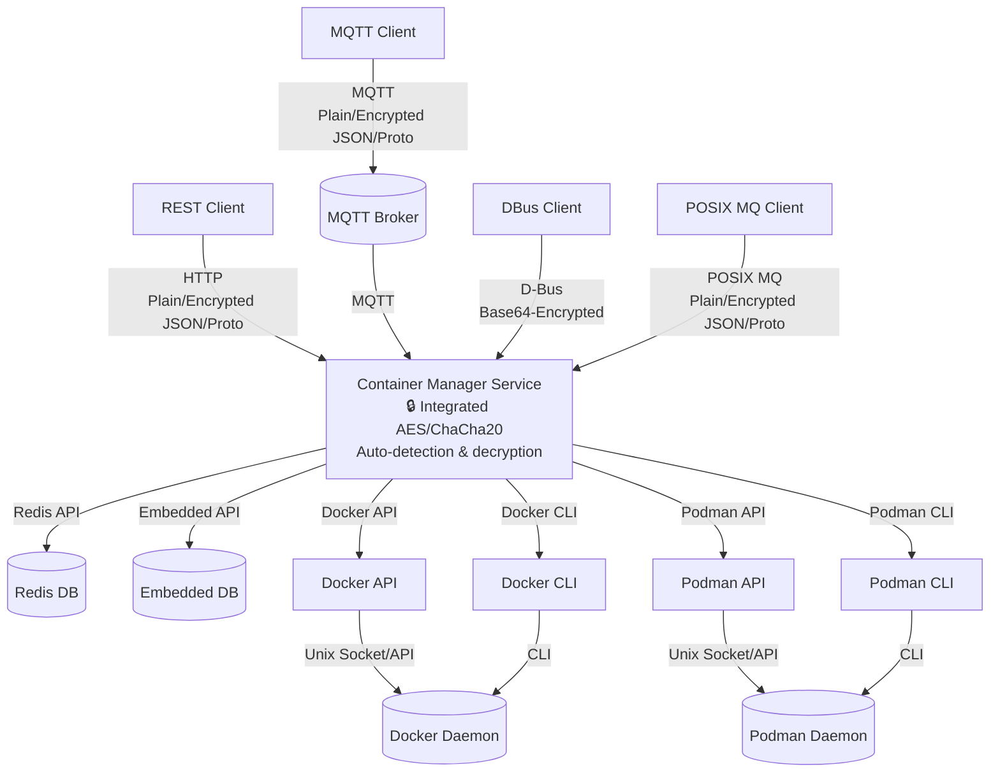

### Complete Architecture diagram

```mermaid
flowchart TD
    %% Clients
    ClientREST[REST Client]
    ClientMQTT[MQTT Client]
    ClientDBus[D-Bus Client]
    ClientMQ[POSIX MQ Client]

    %% API Layer
    REST[REST API Server]
    MQTT[MQTT Subscriber]
    MQ[POSIX Message Queue Consumer]
    DBUS[D-Bus Consumer]

    %% Executor Layer with Integrated Security
    JSON[JSON Request Executor<br/>🔒 Auto-detects & decrypts<br/>AES-256-GCM/ChaCha20]
    PROTO[Protobuf Request Executor<br/>🔒 Auto-detects & decrypts<br/>AES-256-GCM/ChaCha20]

    %% Core Layer
    SERVICE[Container Service Handler]
    COMMANDS[Command Pattern]

    %% Runtime Layer
    DOCKER[Docker Commands]
    PODMAN[Podman Commands]
    DOCKERAPI[Docker API Commands]
    PODMANAPI[Podman API Commands]

    %% Database Layer
    DBIF[IDatabaseHandler]
    REDIS[RedisDatabaseHandler]
    EMBEDDED[EmbeddedDatabaseHandler]

    %% Infrastructure
    MQTTB[MQTT Broker]
    DockerD[(Docker Daemon)]
    PodmanD[(Podman Daemon)]

    %% Client to API
    ClientREST -- HTTP --> REST
    ClientMQTT -- MQTT --> MQTTB
    MQTTB -- MQTT --> MQTT
    ClientDBus -- D-Bus --> DBUS
    ClientMQ -- POSIX MQ --> MQ

    %% API directly to Executor (no separate security layer)
    REST -- "JSON/Proto<br/>(Plain or Encrypted)" --> JSON
    REST -- "JSON/Proto<br/>(Plain or Encrypted)" --> PROTO
    MQTT -- "JSON/Proto<br/>(Plain or Encrypted)" --> JSON
    MQTT -- "JSON/Proto<br/>(Plain or Encrypted)" --> PROTO
    MQ -- "JSON/Proto<br/>(Plain or Encrypted)" --> JSON
    MQ -- "JSON/Proto<br/>(Plain or Encrypted)" --> PROTO
    DBUS -- "JSON/Proto<br/>(Base64-Encrypted)" --> JSON
    DBUS -- "JSON/Proto<br/>(Base64-Encrypted)" --> PROTO

    %% Executor to Core
    JSON -- "Validated Request" --> SERVICE
    PROTO -- "Validated Request" --> SERVICE

    %% Core to Command
    SERVICE -- "Command Dispatch" --> COMMANDS

    %% Command to Runtime
    COMMANDS -- "Docker Ops" --> DOCKER
    COMMANDS -- "Podman Ops" --> PODMAN
    COMMANDS -- "Docker API Ops" --> DOCKERAPI
    COMMANDS -- "Podman API Ops" --> PODMANAPI

    %% Runtime to Database
    DOCKER -- "DB Access" --> DBIF
    PODMAN -- "DB Access" --> DBIF
    DOCKERAPI -- "DB Access" --> DBIF
    PODMANAPI -- "DB Access" --> DBIF

    %% Database Implementations
    DBIF -- "Redis API" --> REDIS
    DBIF -- "Embedded API" --> EMBEDDED

    %% Runtime to Daemon
    DOCKER -- "Docker CLI" --> DockerD
    PODMAN -- "Podman CLI" --> PodmanD
    DOCKERAPI -- "Docker REST API" --> DockerD
    PODMANAPI -- "Podman REST API" --> PodmanD
```

### API & Executor Layers

```mermaid
flowchart TD
subgraph APILayer
REST[REST API Server]
MQTT[MQTT Subscriber]
MQ[POSIX Message Queue Consumer]
DBUS[D-Bus Consumer]
GRPC[GRPC Server planned]
end

subgraph ExecutorLayer["Executor Layer (with Integrated Security)"]
JSON[JSON Request Executor<br/>🔒 Auto-detects encryption<br/>📝 Decrypts AES/ChaCha20]
PROTO[Protobuf Request Executor<br/>🔒 Auto-detects encryption<br/>📝 Decrypts AES/ChaCha20]
end

REST -- "JSON/Proto<br/>(Plain or Encrypted)" --> JSON
REST -- "JSON/Proto<br/>(Plain or Encrypted)" --> PROTO
MQTT -- "JSON/Proto<br/>(Plain or Encrypted)" --> JSON
MQTT -- "JSON/Proto<br/>(Plain or Encrypted)" --> PROTO
MQ -- "JSON/Proto<br/>(Plain or Encrypted)" --> JSON
MQ -- "JSON/Proto<br/>(Plain or Encrypted)" --> PROTO
DBUS -- "JSON/Proto<br/>(Base64 Encrypted)" --> JSON
DBUS -- "JSON/Proto<br/>(Base64 Encrypted)" --> PROTO
GRPC -- "Proto<br/>(Plain or Encrypted)" --> PROTO
```

### Executor, Core, and Runtime Layers

```mermaid
flowchart TD
subgraph ExecutorLayer["Executor Layer (with Security)"]
JSON[JSON Request Executor<br/>🔒 Handles encryption/decryption]
PROTO[Protobuf Request Executor<br/>🔒 Handles encryption/decryption]
end

subgraph CoreLayer
SERVICE[Container Service Handler]
COMMANDS[Command Pattern]
end

subgraph RuntimeLayer
DOCKER[Docker Commands]
PODMAN[Podman Commands]
DOCKERAPI[Docker API Commands]
PODMANAPI[Podman API Commands]
end

JSON -- "Validated Request" --> SERVICE
PROTO -- "Validated Request" --> SERVICE
SERVICE -- "Command Dispatch" --> COMMANDS
COMMANDS -- "Docker Ops" --> DOCKER
COMMANDS -- "Podman Ops" --> PODMAN
COMMANDS -- "Docker API Ops" --> DOCKERAPI
COMMANDS -- "Podman API Ops" --> PODMANAPI
```

### Runtime & Database Layers

```mermaid
flowchart TD
subgraph RuntimeLayer
DOCKER[Docker Commands]
PODMAN[Podman Commands]
DOCKERAPI[Docker API Commands]
PODMANAPI[Podman API Commands]
end

subgraph DatabaseLayer
DBIF[IDatabaseHandler]
REDIS[RedisDatabaseHandler]
EMBEDDED[EmbeddedDatabaseHandler]
end

DOCKER -- "DB Access" --> DBIF
PODMAN -- "DB Access" --> DBIF
DOCKERAPI -- "DB Access" --> DBIF
PODMANAPI -- "DB Access" --> DBIF
DBIF -- "Redis API" --> REDIS
DBIF -- "Embedded API" --> EMBEDDED
```

## Example Sequence Diagram

```mermaid
sequenceDiagram
    participant Client
    participant REST
    participant JSONExec as JSON Executor<br/>🔒 Security
    participant Service
    participant DockerCmd
    participant DBIF
    participant Redis
    participant Embedded

    Client->>REST: POST /execute (Encrypted JSON)
    REST->>JSONExec: Raw payload (encrypted)
    JSONExec->>JSONExec: Auto-detect encryption
    JSONExec->>JSONExec: Decrypt using AES/ChaCha20
    JSONExec->>JSONExec: Parse decrypted JSON
    JSONExec->>Service: Validated request
    Service->>DockerCmd: Dispatch create command
    DockerCmd->>DBIF: Store metadata
    alt Redis backend enabled
        DBIF->>Redis: Store data
        Redis-->>DBIF: Ack
    else Embedded backend (default)
        DBIF->>Embedded: Store data
        Embedded-->>DBIF: Ack
    end
    DockerCmd-->>Service: Result
    Service-->>JSONExec: Result
    JSONExec-->>REST: Response
    REST-->>Client: HTTP 200 OK
```

## Deployment Diagram

```mermaid
graph TD
    %% Clients and Brokers
    Client1[REST Client]
    Client2[MQTT Client]
    Client3[DBus Client]
    Client4[POSIX MQ Client]
    MQTTB[(MQTT Broker)]

    %% Main Service with Integrated Security
    CM[Container Manager Service<br/>🔒 Integrated AES/ChaCha20<br/>Auto-detection & decryption]

    %% Databases
    Redis[(Redis DB)]
    Embedded[(Embedded DB)]

    %% Docker/Podman Daemons and APIs
    Docker[(Docker Daemon)]
    Podman[(Podman Daemon)]
    DockerAPI[Docker API]
    DockerCLI[Docker CLI]
    PodmanAPI[Podman API]
    PodmanCLI[Podman CLI]

    %% Client to Service (protocols handle both plain and encrypted)
    Client1 -->|HTTP<br/>Plain/Encrypted JSON/Proto| CM
    Client2 -->|MQTT<br/>Plain/Encrypted JSON/Proto| MQTTB
    MQTTB -->|MQTT| CM
    Client3 -->|D-Bus<br/>Base64-Encrypted| CM
    Client4 -->|POSIX MQ<br/>Plain/Encrypted JSON/Proto| CM

    %% Database connections
    CM -->|Redis API| Redis
    CM -->|Embedded API| Embedded

    %% Docker connections
    CM -->|Docker API| DockerAPI
    CM -->|Docker CLI| DockerCLI
    DockerAPI -->|Unix Socket/API| Docker
    DockerCLI -->|CLI| Docker

    %% Podman connections
    CM -->|Podman API| PodmanAPI
    CM -->|Podman CLI| PodmanCLI
    PodmanAPI -->|Unix Socket/API| Podman
    PodmanCLI -->|CLI| Podman
```
